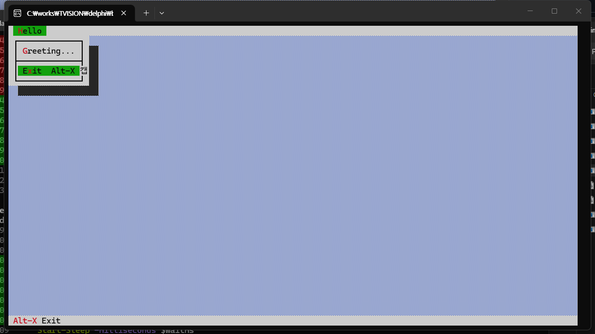
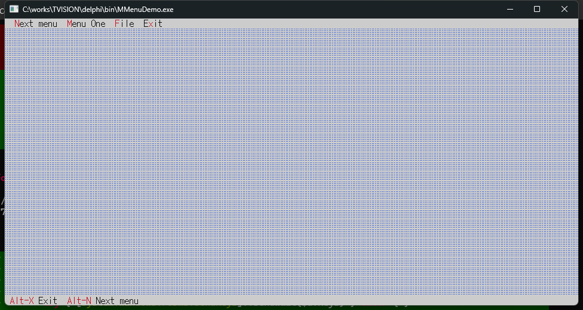
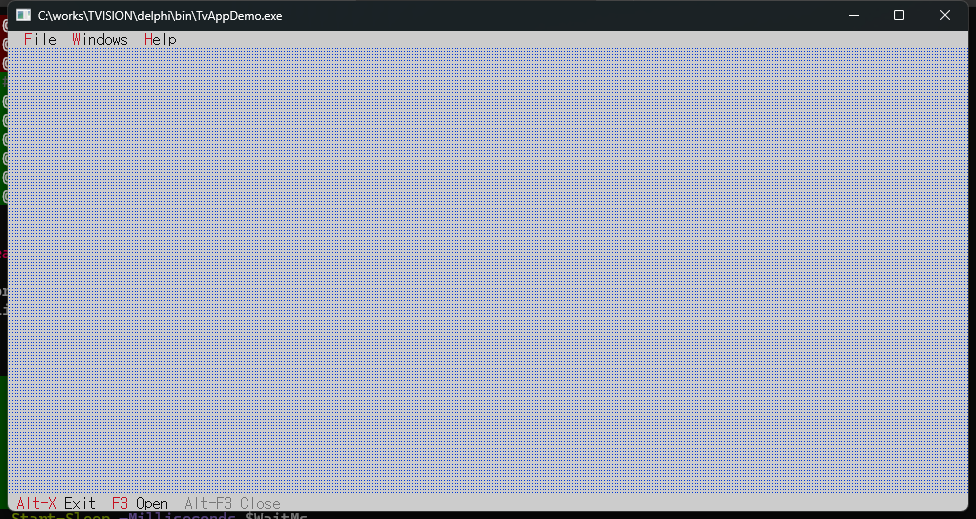
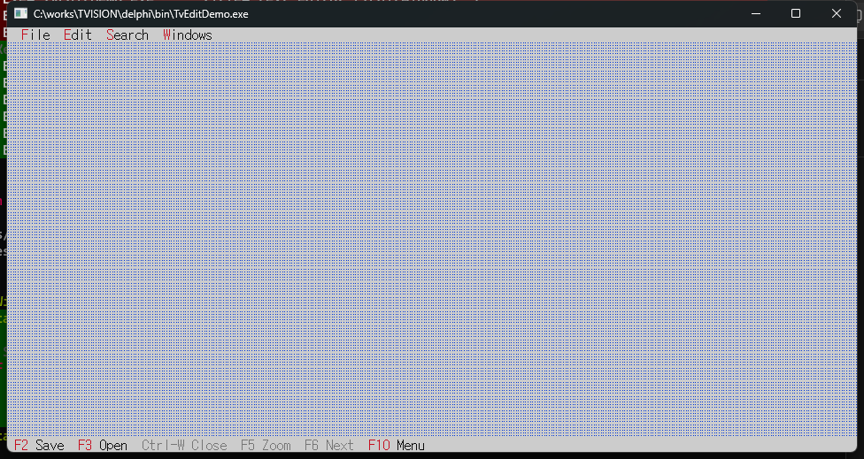
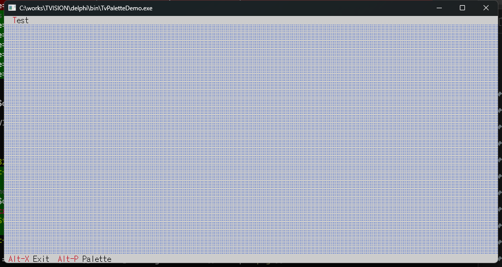
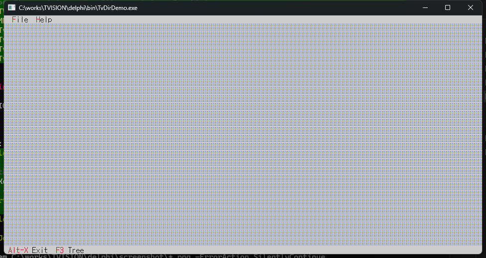
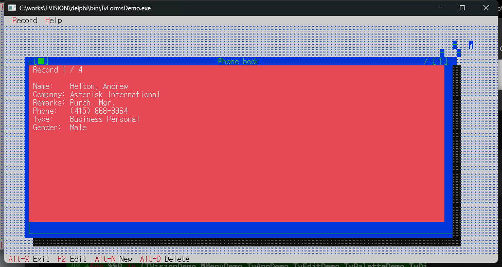

# TVision Delphi Wrapper

A Delphi-friendly C ABI DLL around [magiblot/tvision](https://github.com/magiblot/tvision)
(a modern port of Borland Turbo Vision 2.0). The library is built statically through
**vcpkg**, then re-exposed as a stdcall DLL that any Delphi program can consume.

The repo also ships **9 Delphi sample programs** porting every example from
the original tvision distribution: `hello`, `mmenu`, `palette`, `tvdemo`, `tvdir`,
`tvedit`, `tvforms`, `tvhc`, `avscolor`.

[한국어 README](README.md)

---

## Repository layout
```
TVISION/
├── build_all.bat                # one-click build (vcpkg + DLL + Delphi + native C++)
├── wrapper/                     # C ABI wrapper (C++ -> DLL)
│   ├── include/tvision_c.h      # public header
│   ├── src/tvision_c.cpp        # implementation
│   └── CMakeLists.txt
├── delphi/
│   ├── bin/                     # build outputs (DLL + demo EXEs)
│   ├── source/TVision.pas       # Delphi import unit (auto-selects Win32/Win64)
│   ├── examples/                # one folder per .dpr
│   │   ├── TVisionDemo/   MMenuDemo/   TvAppDemo/   TvEditDemo/
│   │   ├── TvPaletteDemo/ TvDirDemo/   TvHc/        TvFormsDemo/
│   │   └── AvsColor/
│   └── screenshot/              # captured PNGs + capture.ps1
└── tvision-src/                 # upstream sources (optional, .gitignored)
    └── bin/                     # native C++ sample EXEs (built by build_all.bat)
```

---

## Prerequisites
| Tool | Version / location |
|---|---|
| **vcpkg** | `VCPKG_ROOT` env var, or default `D:\OpenSource\vcpkg` |
| **Visual Studio 2022 Build Tools** | cl.exe 19.44 or later |
| **CMake** | 3.20 or later |
| **Delphi 13** (Studio 37.0) | `dcc64.exe` |

---

## Quick start

### 1. Build everything
```cmd
build_all.bat
```
The script runs the following steps in order:

1. `vcpkg install tvision:{x64,x86}-windows-static-md`
2. CMake-build `wrapper/` for x64 and x86 -> `tvision64.dll` / `tvision32.dll`
3. Copy DLLs into `delphi/bin/`
4. Build the 9 Delphi demos -> `delphi/bin/*.exe`
5. If `tvision-src/` is present, also build the 10 original C++ samples
   -> `tvision-src/bin/*.exe`

### 2. Run a demo
```cmd
cd delphi\bin

TVisionDemo.exe       :: hello-style: Hello menu / Greeting dialog
MMenuDemo.exe         :: runtime menu-bar swap (One/Two/Three rotation)
TvAppDemo.exe         :: file open + window management + About
TvEditDemo.exe        :: multi-file text editor (TEditWindow)
TvPaletteDemo.exe     :: custom palette view
TvDirDemo.exe         :: directory tree viewer
TvFormsDemo.exe       :: phonebook form (Insert/Edit/Delete/Next/Prev)
TvHc.exe demohelp.txt :: help-context compiler (.h + .pas output)
AvsColor.exe          :: color quantization (4 quantized PPMs)
```

### 3. Build a single sample manually
```cmd
cd delphi
"C:\Program Files (x86)\Embarcadero\Studio\37.0\bin\dcc64.exe" -B ^
    -E"%cd%\bin" ^
    -N"%cd%\source" ^
    -U"%cd%\source" ^
    -I"%cd%\source" ^
    "examples\TvAppDemo\TvAppDemo.dpr"
```

---

## Screenshots

| Demo | Capture |
|---|---|
| **TVisionDemo**   |    |
| **MMenuDemo**     |      |
| **TvAppDemo**     |      |
| **TvEditDemo**    |     |
| **TvPaletteDemo** |  |
| **TvDirDemo**     |      |
| **TvFormsDemo**   |    |

> To re-capture screenshots:
> ```cmd
> powershell -ExecutionPolicy Bypass -File delphi\screenshot\capture.ps1
> ```
> `TvHc` and `AvsColor` are CLI-only and excluded from the gallery.

---

## Demo-to-original mapping

| Delphi port | Original sample | Demonstrates |
|---|---|---|
| `TVisionDemo.dpr`   | [`hello.cpp`](https://github.com/magiblot/tvision/blob/master/hello.cpp) | TApplication lifecycle, menu, status, dialog, button |
| `MMenuDemo.dpr`     | [`mmenu`](https://github.com/magiblot/tvision/tree/master/examples/mmenu) | Runtime menu-bar swap (One/Two/Three + Next rotation) |
| `TvAppDemo.dpr`     | [`tvdemo`](https://github.com/magiblot/tvision/tree/master/examples/tvdemo) | File-Open via `TFileDialog`, Window menu (Tile/Cascade/Close All), About |
| `TvEditDemo.dpr`    | [`tvedit`](https://github.com/magiblot/tvision/tree/master/examples/tvedit) | Multi-file text editor (`TEditWindow`), Open/New, Edit/Search/Window |
| `TvPaletteDemo.dpr` | [`palette`](https://github.com/magiblot/tvision/tree/master/examples/palette) | Custom `TView` with custom draw + palette via `TvCustomView_Create` |
| `TvDirDemo.dpr`     | [`tvdir`](https://github.com/magiblot/tvision/tree/master/examples/tvdir) | Directory tree viewer (custom view replacing TOutline) |
| `TvFormsDemo.dpr`   | [`tvforms`](https://github.com/magiblot/tvision/tree/master/examples/tvforms) | Phonebook form - validation, Insert/Edit/Delete, Next/Prev |
| `TvHc.dpr`          | [`tvhc`](https://github.com/magiblot/tvision/tree/master/examples/tvhc) | Help-context compiler (CLI) - emits both `.h` and Delphi `.pas` |
| `AvsColor.dpr`      | [`avscolor`](https://github.com/magiblot/tvision/tree/master/examples/avscolor) | RGB to xterm-16/256 quantization CLI (PPM in/out) |

---

## API overview (`tvision_c.h` / `TVision.pas`)

TVision is a virtual-method-heavy C++ framework, so re-exposing the entire class
tree is impractical. The wrapper instead uses **opaque handles + callbacks +
the builder pattern** to expose a focused, easy-to-bind subset.

### Application lifecycle
```pascal
LApp := TvApp_Create(@MenuBuilder, @StatusBuilder, @EventHandler,
                     @IdleHandler { or nil }, AAppData);
TvApp_Run(LApp);
TvApp_Destroy(LApp);
```
Related: `TvApp_Suspend`, `TvApp_Resume`, `TvApp_GetDeskTop`, `TvApp_GetExtent`,
`TvApp_InsertWindow`, `TvApp_ExecView`, `TvApp_SetMenuBar`,
`TvApp_DesktopTile`, `TvApp_DesktopCascade`, `TvApp_BroadcastCmd`, `TvApp_Redraw`.

### Menu builder (called inside the menu-builder callback)
```pascal
TvMenu_BeginBar(ARect);
  TvMenu_AddSub('~F~ile', kbAltF);
    TvMenu_AddItem('~O~pen', cmOpen, 0, nil);
    TvMenu_AddLine;
    TvMenu_AddItem('E~x~it', TV_cmQuit, TV_kbAltX, 'Alt-X');
  TvMenu_EndSub;
Result := TvMenu_FinishBar;
```

### Status-line builder
```pascal
TvStatus_Begin(ARect);
TvStatus_AddItem('~Alt-X~ Exit', TV_kbAltX, TV_cmQuit);
TvStatus_AddItem('',             TV_kbF10,  TV_cmMenu);
Result := TvStatus_Finish;
```

### Dialogs / windows / widgets
- `TvDialog_Create`, `TvWindow_Create`, `TvEditWindow_Create`
- `TvStaticText_Create`, `TvButton_Create`, `TvLabel_Create`,
  `TvInputLine_Create`, `TvCheckBoxes_Create`, `TvRadioButtons_Create`
- `TvView_Insert`, `TvView_SetData`, `TvView_GetData`,
  `TvView_Destroy`, `TvView_Redraw`, `TvView_SetOptionCentered`

### Standard boxes / file dialog
- `TvMessageBox(msg, options)` — `TV_mfWarning|Error|Information|Confirmation`
  combined with button flags
- `TvInputBox(title, label, buffer, bufferSize)`
- `TvFileDialog_Create`, `TvFileDialog_GetFileName`

### Custom views (Delphi-side draw / handleEvent)
```pascal
LView := TvCustomView_Create(@LRect,
                             @MyDrawCallback,    // procedure(view, userData)
                             @MyEventCallback,   // function(view, event, userData)
                             @PaletteBytes[0], Length(PaletteBytes),
                             AUserData);
```
Inside the draw callback, paint with `TvView_GetSize`, `TvView_GetColor`,
`TvView_WriteText`, `TvView_WriteFill`.

### Color quantization (used by avscolor)
- `TvColor_RGBtoXTerm16(rgb)` — 16-color index (0..15)
- `TvColor_RGBtoXTerm256(rgb)` — 256-color index (16..255)
- `TvColor_XTerm256toRGB(idx)` — inverse mapping

### Event callback
```pascal
function EventHandler(const E: PTvEvent; AUserData: Pointer): Integer; stdcall;
```
- If the bit `E^.What and TV_evCommand` is set, `E^.Command` is the command ID.
- Return 1 to make the wrapper call `clearEvent` on the event.

---

## Calling convention / DLL selection
- C ABI: **`__stdcall`** (Windows)
- Delphi: **`stdcall`**
- DLL name is auto-selected by `{$IFDEF WIN64}` in `TVision.pas`:
  - 64-bit: `tvision64.dll`
  - 32-bit: `tvision32.dll`

---

## Memory-management rules
- All `Tv*_Create`, `TvMenu_FinishBar`, `TvStatus_Finish` calls allocate a new TView
  with `new` under the hood.
- After `TvView_Insert(parent, child)`, the parent (group) owns the child. Don't
  call `TvView_Destroy` on it separately.
- After a modal `TvApp_ExecView`, call `TvView_Destroy(dialog)` to clean up
  (equivalent to TVision's `destroy()`).
- `TvView_Destroy` automatically removes the view from its owner before deleting,
  so the underlying screen area is repainted. Otherwise the desktop holds a
  dangling pointer and frame fragments stay on screen.
- `TvApp_Destroy` cleans up the desktop, menu bar, status line and every child view.

---

## Porting notes (why some features are simplified)
- **`TMultiMenu` (mmenu)** is a C++ subclass of `TMenuBar`, which the C ABI cannot
  reasonably expose. The Delphi port instead swaps the menu bar at runtime via
  `TvApp_SetMenuBar` for the same effect.
- **`TClockView` / `THeapView` / `TPuzzleWindow` / `TFileWindow` (tvdemo)** rely
  heavily on virtual-method overrides. The Delphi port covers only the
  non-subclassing parts: menus, file dialog, window management.
- **`TOutline` (tvdir)** is not exposed by the wrapper. The port draws an indented
  text tree by hand and handles its own keyboard scrolling.
- **`THelpFile` binary output (tvhc)** is an internal tvision format and out of scope.
  The port handles only `.topic` parsing and emits `.h` / `.pas` headers.
- **AviSynth video filter (avscolor)** has no Delphi equivalent. The port instead
  exposes the same color-quantization helpers in the wrapper and reuses them in a
  standalone CLI that processes PPM images.
- **Custom `TInputLine` subclasses (tvforms)** like `TKeyInputLine` /
  `TNumInputLine`, plus `.f16`/`.f32` binary form definitions (which use
  `TStreamable` serialization), are not exposed. The Delphi port keeps the same
  layout and seed data, performs validation at the dialog level, and stores
  records in an in-memory collection.

---

## Limitations
The wrapper aims to cover **the common Turbo Vision UI patterns** in a focused
subset. You can extend `wrapper/src/tvision_c.cpp` to add more bindings as needed.

Currently not exposed:
- **`TListBox` / `TListViewer` / `TOutline`** (scrollable list / tree widgets)
- **`THelpFile` / `THelpWindow`** (TVision help system)
- **`TStreamable`** (object serialization)
- **`TInputLine` virtual-method overrides** (custom validating fields)
- **`TWindow::getPalette()` overrides** (window-specific palette swaps)

---

## License
- Wrapper / Delphi port / demo code: **[MIT License](LICENSE)**
- Upstream [magiblot/tvision](https://github.com/magiblot/tvision): MIT
- Original [Borland Turbo Vision 2.0](https://en.wikipedia.org/wiki/Turbo_Vision):
  Borland International, 1994 (redistribution permitted)
